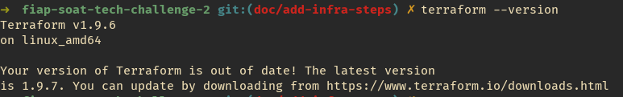
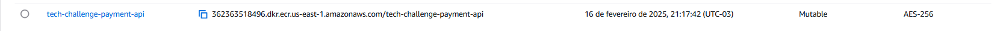
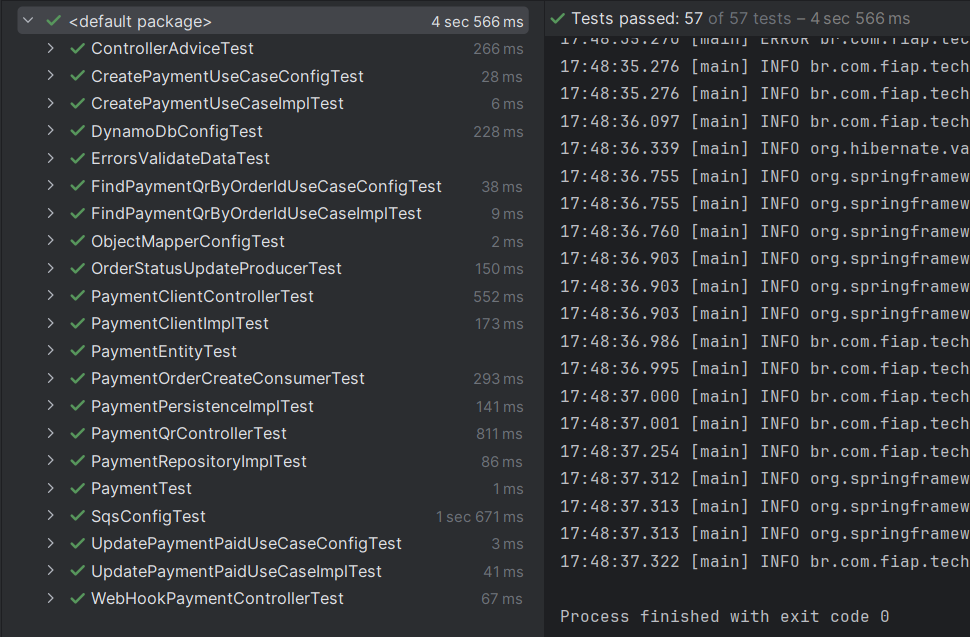
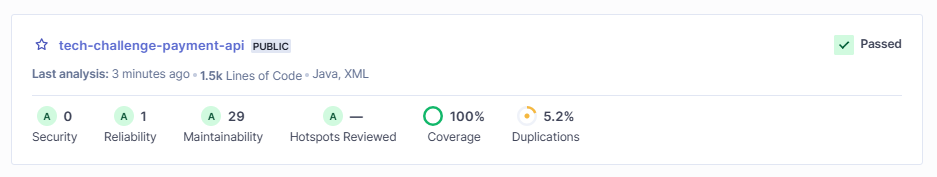
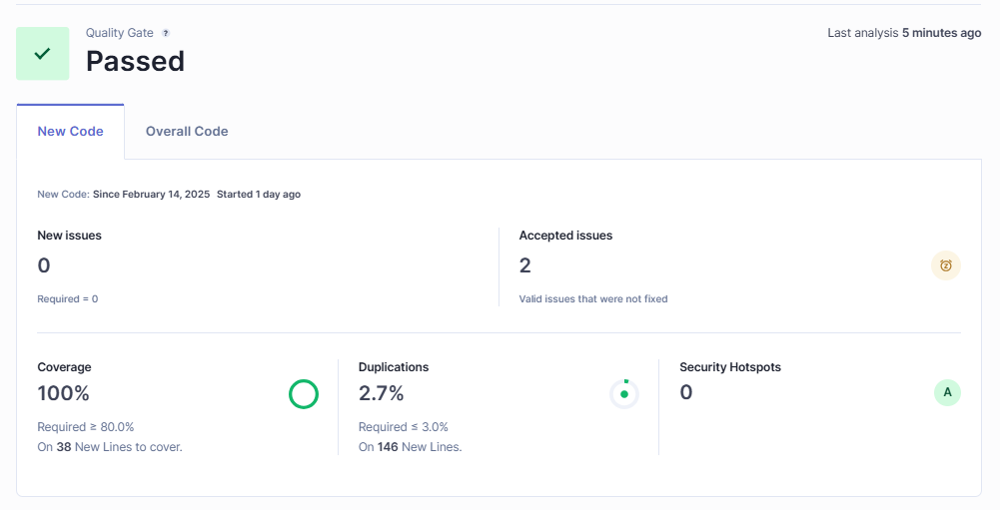
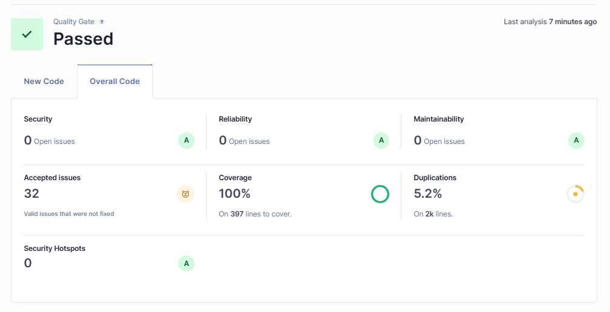

<div align="center">
  
# Tech Challenge - Payment API


<br>

</div>

## 💻 Descrição

O **Tech Challenge - Payment API** é um microserviço desenvolvido em **Java** com **Spring Boot**, seguindo os princípios da **Clean Architecture**. Ele é responsável por gerenciar os endpoints de **comunicação com o gateway de pagamento externo** do restaurante e **consulta do QR do pedido** para o pagamento.

## 🛠 Tecnologias Utilizadas


## 💫 Arquitetura

O projeto adota a **Clean Architecture**, garantindo flexibilidade, testabilidade e manutenção escalável.

## ⚙️ Configuração

### Pré-requisitos

1. É necessário executar a pipeline para criar o VPC no repositório: https://github.com/fiap-soat-12/tech-challenge-vpc
2. É necessário executar a pipeline para criar o SQS no repositório: https://github.com/fiap-soat-12/tech-challenge-queue

### Desenvolvimento

- **[Java 21](https://docs.oracle.com/en/java/javase/21/)**: Documentação oficial do Java 21.
- **[Maven 3.6.3+](https://maven.apache.org/)**: Site oficial do Maven.
- **[Docker](https://www.docker.com/)**: Site oficial do Docker.
- **[Docker Compose](https://docs.docker.com/compose/)**: Documentação oficial do Docker Compose.
- **[DynamoDB](https://aws.amazon.com/pt/dynamodb/)**: Site oficial da DynamoDB.
- **[Sonarqube](https://www.sonarsource.com/products/sonarqube/)**: Site oficial do Sonarqube.
- **[Kubernetes](https://kubernetes.io/pt-br/docs/home/)**: Documentação oficial do Kubernetes.
- **[Terraform](https://www.terraform.io/)**: Site oficial do Terraform.
- **[AWS](https://aws.amazon.com/pt/)**: Site oficial da AWS.

### 🚀 Execução

### Subindo a aplicação com Docker Compose

1. Executar o comando:

```sh
docker compose up
```

3. O serviço estará disponível em `http://localhost:8100/payment`

### Subindo a Payment API
  Caso deseje subir a Payment API, basta seguir os seguintes passos:
  
  1. Certificar que o Terraform esteja instalado executando o comando `terraform --version`;
  

  2. Certificar que o `aws cli` está instalado e configurado com as credenciais da sua conta AWS;
  

  3. Acessar a pasta `terraform` que contém os arquivos que irão criar a Payment API;
  4. Inicializar o Terraform no projeto `terraform init`;
  5. Verificar que o script do Terraform é valido rodando o comando `terraform validate`;
  6. Executar o comando `terraform plan` para executar o planejamento da execução/implementação;
  7. Executar o comando `terraform apply` para criar a Payment API;
  8. Após a execução do Terraform finalizar, verificar se a Payment API subiu corretamente na AWS;
  

## 📄 Documentação da API

A documentação da API pode ser acessada através do Swagger:

```bash
http://localhost:8100/payment/swagger-ui/index.html
```

## 🔃 Fluxo de Execução das APIs

1. Busca do **QR** do pedido (GET) `/payment/v1/qrs/{orderId}`
2. **WebHook** de pagamento (POST) `/payment/v1/webhook-payment`

## ✅ Cobertura de Testes

### Testes Unitarios


### Scan do Sonar




### JaCoCo
Cobertura do Projeto usando o JaCoCo: 
[Link](https://fiap-soat-12.github.io/tech-challenge-payment-api/)


## 📚 Event Storming


Acesso ao MIRO com o Event Storming:
[Event Storming](https://miro.com/app/board/uXjVK1ekBDM=/)
